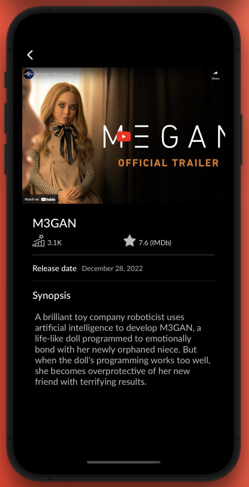
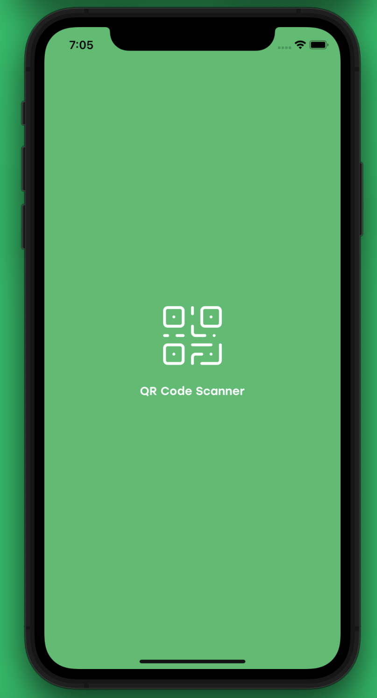
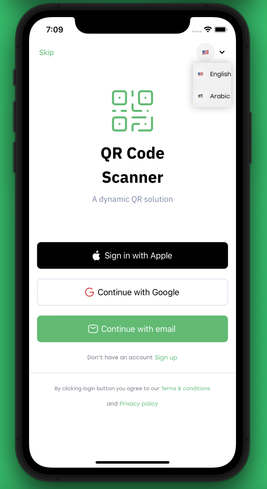
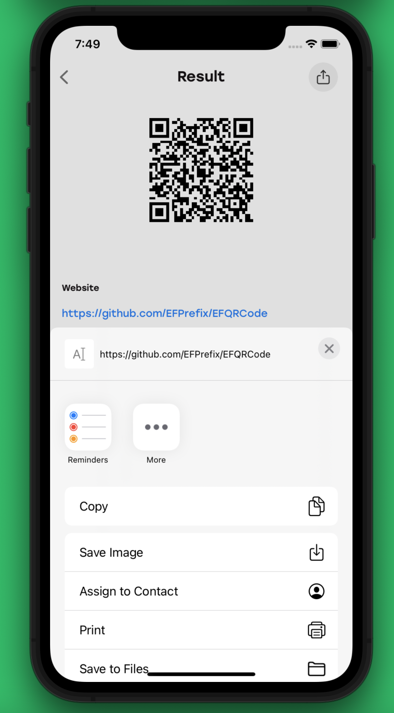

<h1 align="center">Hi, I hope you’re doing well  👨🏻‍💻</h1>

<h1 align="center">I'm a computer engineer who is passionate about iOS developer</h1>

# Personal Projects
## * 📱 Movies Time
Movies Time is a Movie app made in UIKit.

        

### Technologies Used
- Async/Await URLSession requests
- Core Data
- APIs
- Notification Center
- Third-party libraries

## * 📱 QR Code Scanner
QR Code Scanner is a Scanner app made in UIKit.

             

### Technologies Used
- Firebase Cloud Messaging(FCM) 
- Firebase Authentication
- Firestore Database
- Core Data
- User Defaults
- custom camera
- Localization(Arabic/English)
- Regex
- Combine

## * 📱 Educational Apps
These apps for gaining knowledge about a specific subject or topic.

    
